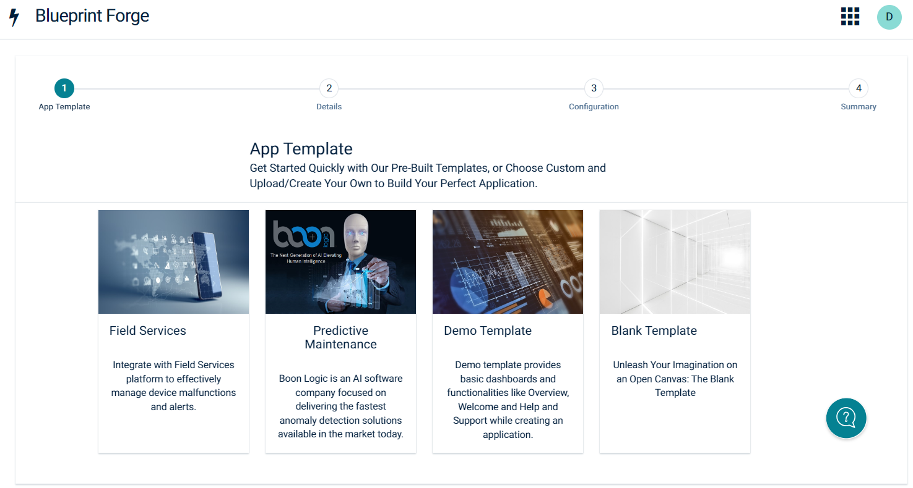

# Blueprint Forge for Cumulocity

Blueprint Forge provides a simple, coding-free way to build cumulocity application using pre-built solution templates. Blueprint Forge is an open-source tool that empowers you to initially build an application from a template and later enhance it with additional plugins, dashboards, branding and much more. It's being managed by the Software AG's open-source community but not officially supported by Software AG. You can log any issues at GitHub or ask any question on the Software AG Tech Community. Support will be provided on best endeavours.

## What's new?

* **Multiple Welcome Templates:** Now user can select his Welcome dashboard while creating the application. Different Welcome Template for various fields is available.
* **Validation for Installing:** Microservice gets installed only if the tenant has enablement for it.

## Features
* **Solution Templates:** Blueprint Forge support template-driven approach which enable delivery and maintenance of pre-built solution templates with a seamless user experience. As in initial version, we have Field Services, Predictive Maintenance and Demo Template as our pre-built solution templates.
* **Easy Customization:** Simplified customization to configure dashboard, devices, widgets and microservices.
* **Dashboard Catalog:** User can select any pre-designed template for dashboard and ability to install dependent widgets.
* **Installation of plugins and microservice:** Provides option to install plugins and microservices while creating an application.
* **Provision to add essential dashboards:** Effortlessly Craft Applications Using Demo Template's Essential Dashboards and Features – Explore the Overview, Receive a Warm Welcome, Find Help and Support.
* **Blank Template support:** The Blank Template Lets You Build Applications from Scratch, No Dashboards or Plugins Preselected.
* **Support for Device group and Asset Type:** Link not just devices, user can also link Device Group and Asset type with the dashboard.
* **Configure while creating:** User can configure the application while creating it.
* **Custom Branding:** Provides flexibility and control over application’s look and feel. Now user can use color picker to choose millions of colors to customize branding. Header, Action bar and tab bar are also customizable. User can add his own branding by choosing different colors of his choice in the application. 
## Installation

### Install Blueprint Forge

1. Grab the **[Latest Release Zip](https://github.com/SoftwareAG/cumulocity-blueprint-forge/releases)**
2. Go to the **Administration view** in your tenant (/apps/administration)
3. Open the **Ecosystem** section in the navigator
4. Go to **Extensions**
5. Click **Add Exctension Package**
6. Drop zip file or select from your system location.
7. Click **Done**

### Incremental Upgrade

1. Grab the **[Latest Release Zip](https://github.com/SoftwareAG/cumulocity-blueprint-forge/releases)**
2. Go to the **Administration view** in your tenant (/apps/administration)
3. Open the **Ecosystem** section in the navigator
4. Go to **Extensions**
5. Click **Blueprint Forge**
6. Click "Versions"
7. Drop zip file or select from your system location.
8. Click **Done**

## QuickStart

This guide will teach you how to create your first application using the Blueprint Forge.

**NOTE:** This guide assumes you have followed the [Installation instructions](#Installation)

1. Open the Blueprint Forge package which was installed (refer to Installation step)
2. Click `Deploy application`
3. Enter the application details and click `Save`

You have created an application.

4. Navigate to the application created.
5. Click on Open and you can see the welcome screen.
6. Click on `Start`.
7. You will see the list of templates, click any of the template using which you want to create an application.
8. You will see the details page, click on continue.
9. Select the dashboards, plugins and microservices of you choice.
10. Fill the device details if it is required by the dashboard.
11. You can also fill the configuration for the widgets if needed.
12. Click on `Continue`.
13. It will take a while to install the dependent packages. Then click on `Save and Reload`.

Congratulations! You have successfully created an application using Blueprint Forge with template of your choice.

### User Guide

#### How to upgrade Blueprint Forge application

Blueprint Forge application can be upgraded if new version update is available. If newer update is available, an icon (on hover of it, it shows "Update available") is seen next to the application version below the application name. 

Follow below steps to upgrade your application:

1. Go to Applications -> All applications. 
2. Click on the Blueprint Forge application name which is created. You will be navigated to Application Properties.
3. You will see "Update available" button in the Properties. Click on it.
4. Pop up appears for confirmation. Click on "Update" to upgrade your application.

Congratulations! You have successfully updated your application. You can see the latest version next to your application name.

------------------------------

This tools are provided as-is and without warranty or support. They do not constitute part of the Software AG product suite. Users are free to use, fork and modify them, subject to the license agreement. While Software AG welcomes contributions, we cannot guarantee to include every contribution in the master project.
_____________________
For more information you can Ask a Question in the [TECH Community Forums](https://tech.forums.softwareag.com/tag/Cumulocity-IoT).

