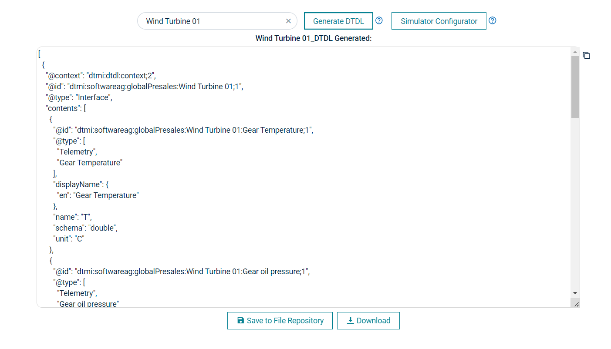
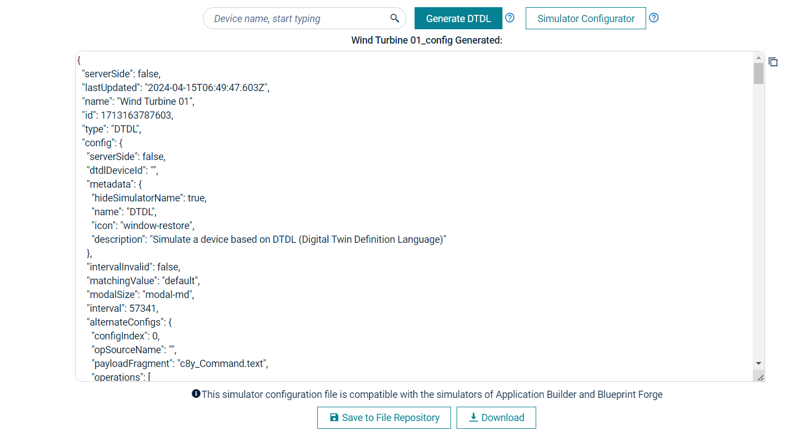
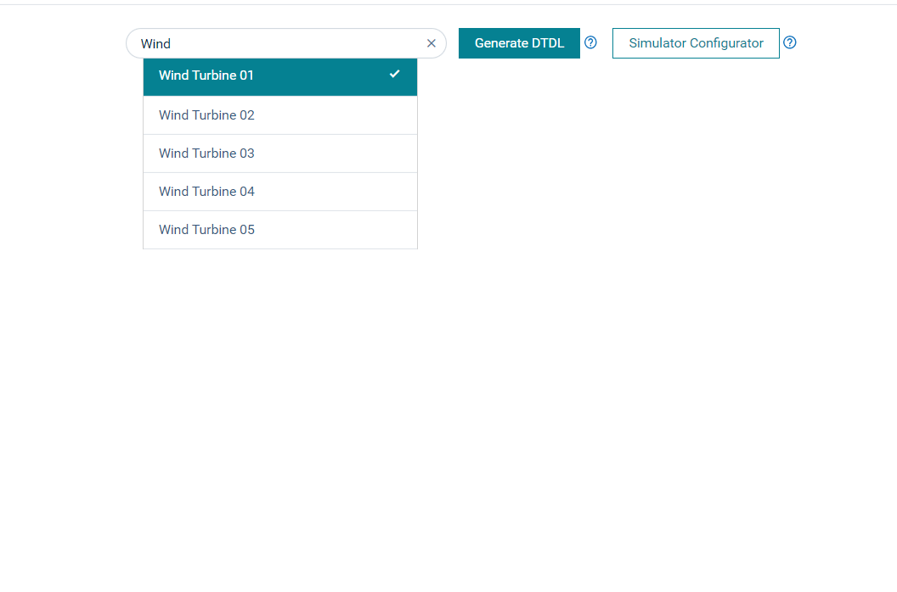
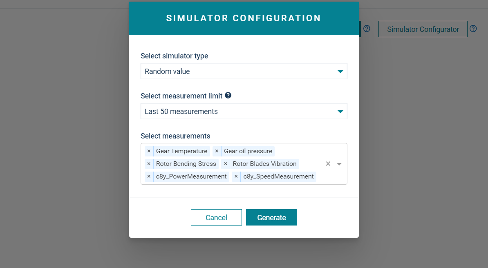

# Cumulocity Device DTDL Generator Plugin 

The Device DTDL Generator Plugin is the Cumulocity module federation plugin provided as part of Blueprint Forge. This plugin can be used in any blueprint Forge application.
The Device DTDL Generator Plugin generates DTDL for a device and it also creates a Simulator Configuration based on the device selected.

<kbd></kbd>
<kbd></kbd>

## Features

*  **Copy to clipboard:** The dtdl generated or simulator configuration can be copied to clipboard with click of a button.

*  **Save to File Repository:** The dtdl generated or simulator configuration can be saved to tenant's File Repository.

*  **Download:** The dtdl generated or simulator configuration can be downloaded as a json file.

## Prerequisite
   Cumulocity c8ycli >=1018.x.x
   
## Installation

### Runtime plugin Deployment?

* This plugin support runtime deployment. Download [Runtime Binary](https://github.com/SoftwareAG/cumulocity-smart-echart-widget-plugin/releases/download/1.0.2/sag-ps-pkg-smart-echart-1.0.2.zip) and install via Administrations --> Ecosystems --> Extensions.

* Look for `Device DTDL Generator` and install it in your choice of application.

## QuickStart

This guide will teach you how to access DTDL generator plugin in your existing application.

1. Open your application where you have installed the plugin

2. Expand `Configuration` tab from the left navigation bar

3. Click `DTDL Generator`

Congratulations! Enjoy generating DTDL for your device.

## User Guide

1. Generate DTDL

-   **Device:** Start typing device name and select the device from typeahead list.

<kbd></kbd>

-   Click on 'Generate DTDL' button to generate dtdl for the selected device.

<kbd></kbd>

-   **Copy to clipboard:** This button will copy the dtdl generated to your clipboard.

-   **Save to File Repository:** This will save a json file with the dtdl generated to your File Repository.

-   **Download:** This will download a json file with the dtdl generated to your local downloads.

2. Configure Simulator

-   **Device:** Start typing device name and select the device from typeahead list.

<kbd></kbd>

-   Click on 'Simulator Configurator' button to generate Simulator Configuration based on the selected device. You can check and
edit the measurements.

<kbd></kbd>

<kbd></kbd>

-   **Copy to clipboard:** This button will copy the generated simulator configuration to your clipboard.

-   **Save to File Repository:** This will save a json file with the simulator configuration to your File Repository.

-   **Download:** This will download a json file with the simulator configuration to your local downloads.

------------------------------

This plugin is provided as-is and without warranty or support. They do not constitute part of the Software AG product suite. Users are free to use, fork and modify them, subject to the license agreement. While Software AG welcomes contributions, we cannot guarantee to include every contribution in the master project.
_____________________
For more information you can Ask a Question in the [TECH Community Forums](https://tech.forums.softwareag.com/tag/Cumulocity-IoT).
